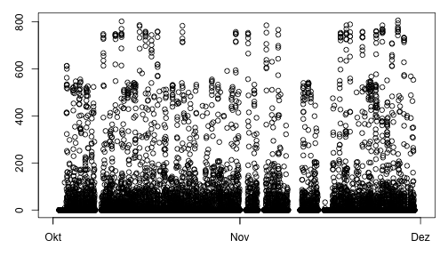
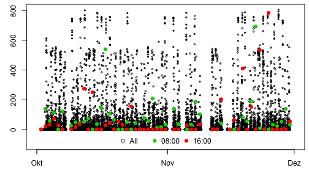
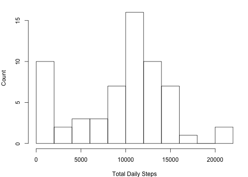
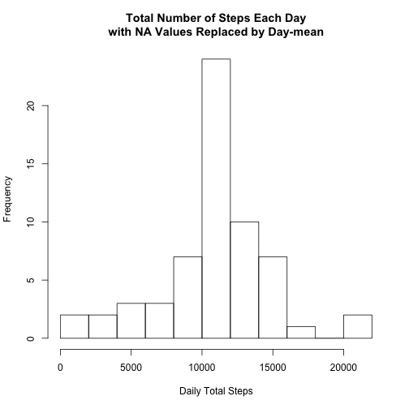
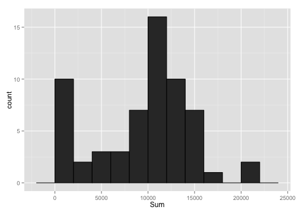
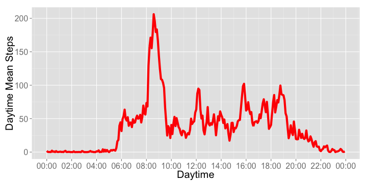
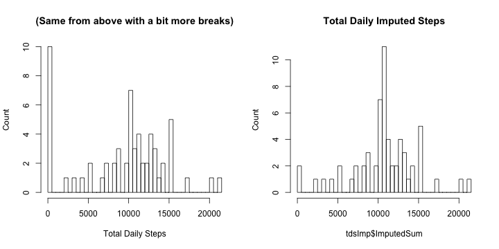
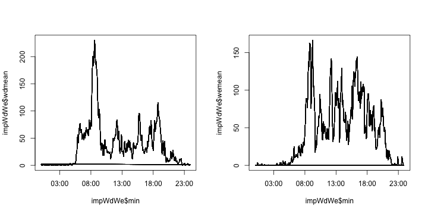

# Reproducible Research: Peer Assessment 1

Martin Hediger
==============

## Introduction
It is now possible to collect a large amount of data about personal movement using activity monitoring devices such as a Fitbit, Nike Fuelband, or Jawbone Up. These type of devices are part of the “quantified self” movement – a group of enthusiasts who take measurements about themselves regularly to improve their health, to find patterns in their behavior, or because they are tech geeks. But these data remain under-utilized both because the raw data are hard to obtain and there is a lack of statistical methods and software for processing and interpreting the data.

This assignment makes use of data from a personal activity monitoring device. This device collects data at 5 minute intervals through out the day. The data consists of two months of data from an anonymous individual collected during the months of October and November, 2012 and include the number of steps taken in 5 minute intervals each day.


## Loading and preprocessing the data
### 1 Loading the data
The data is loaded using

```r
d <- read.csv("activity.csv", header=TRUE)
```
Note, the `activity.csv` file needs to be in the same working directory like this .Rmd report.

### 2 Preprocessing the data
Using `head(d)` and `str(d)` the data is inspected.
The data appears to be tidy, but the `interval` variable, which responds to a daytime, is encoded as an `int` which does not make much sense (i.e. there are discontinuities at every full our from e.g. 2255 to 2300 or from 2355 to 0).  
Therefore, the data is processed in that a time and date encoding variable is added to the data set.
This is done using the `data.table` package which allows for easy addition of a new column `dateint` which combines the date and the interval.

```r
library(data.table)
```

```
## data.table 1.9.2  For help type: help("data.table")
```

```r
d <- as.data.table(d)
d[, dateint:=paste(as.character(d$date), sprintf("%04d", d$interval))]
```

```
##        steps       date interval         dateint
##     1:    NA 2012-10-01        0 2012-10-01 0000
##     2:    NA 2012-10-01        5 2012-10-01 0005
##     3:    NA 2012-10-01       10 2012-10-01 0010
##     4:    NA 2012-10-01       15 2012-10-01 0015
##     5:    NA 2012-10-01       20 2012-10-01 0020
##    ---                                          
## 17564:    NA 2012-11-30     2335 2012-11-30 2335
## 17565:    NA 2012-11-30     2340 2012-11-30 2340
## 17566:    NA 2012-11-30     2345 2012-11-30 2345
## 17567:    NA 2012-11-30     2350 2012-11-30 2350
## 17568:    NA 2012-11-30     2355 2012-11-30 2355
```

```r
str(d)
```

```
## Classes 'data.table' and 'data.frame':	17568 obs. of  4 variables:
##  $ steps   : int  NA NA NA NA NA NA NA NA NA NA ...
##  $ date    : Factor w/ 61 levels "2012-10-01","2012-10-02",..: 1 1 1 1 1 1 1 1 1 1 ...
##  $ interval: int  0 5 10 15 20 25 30 35 40 45 ...
##  $ dateint : chr  "2012-10-01 0000" "2012-10-01 0005" "2012-10-01 0010" "2012-10-01 0015" ...
##  - attr(*, ".internal.selfref")=<externalptr>
```
Before the `dateint` variable can be converted to POSIXlt, the data.table object needs to be converted back to data.frame type.

```r
d <- as.data.frame(d)
d$dateint <- strptime(d$dateint, format="%Y-%m-%d %H%M")
str(d)
```

```
## 'data.frame':	17568 obs. of  4 variables:
##  $ steps   : int  NA NA NA NA NA NA NA NA NA NA ...
##  $ date    : Factor w/ 61 levels "2012-10-01","2012-10-02",..: 1 1 1 1 1 1 1 1 1 1 ...
##  $ interval: int  0 5 10 15 20 25 30 35 40 45 ...
##  $ dateint : POSIXlt, format: "2012-10-01 00:00:00" "2012-10-01 00:05:00" ...
```
Now we have what we want.

## What is mean total number of steps taken per day?
Before answering the specific questions, first a couple of exploratory steps are taken to gain a better understanding of the data.
In an exploratory spirit, the first thing that comes to mind when reading this question is just to plot the steps against the date.

```r
par(mar=c(3,3,1,1))
plot(d$dateint, d$steps)
```

 

**Analysis.**
As seen, the informational value of this plot is limited.
Probably the only real information gained from this plot is that there are days with missing values (gaps on x axis), but also this information is only appriximate because it could be that a day is partially `NA`.  
But nevertheless, the plot helps a lot in understanding what is asked for and also provides a number of immediate observations:  
1 Not all days have data  
2 There are multiple data points per day  
3 What would make sense is to get a plot of day time(x) vs. steps(y)  
4 Ideally, this plot would have light gray lines for the individual days and a solid black line for the average of all the days  
5 As an exercise, in this plot one could have a say 4 lines for times 08:00, 12:00, 16:00 and 22:00 connecting the respective points of each day.  
6 Also realized, each day has multiple data points, but each interval (i.e. time has only one data point for each day)  
7 Another meaningful plot would be the number of steps of each day (y) against the time from october to december (x).

A data point (i.e. row) can be specified using an inline `strptime` object:

```r
d[d$dateint==strptime("2012-10-20 1600", format="%Y-%m-%d %H%M"), ]
```

```
##      steps       date interval             dateint
## 5665    53 2012-10-20     1600 2012-10-20 16:00:00
```
All data points at 4 pm can be found by using `intervall==1600` as an argument to the `which` function:

```r
d[which(d$interval==1600), ]$steps
```

```
##  [1]  NA   0  20  32  70  27   0  NA   0  15  35 275   0 250   0   0  28
## [18]  44   0  53  30   0 154   0   0   0   0   0   0   0   0  NA   0   0
## [35]  NA  27   0   0  33  NA  NA   0   0 203  NA   0  64   0 411   0 151
## [52]   0 533   0 785   0   0   0   0  53  NA
```
The first sanity check is to notice that indeed, the length of this result is 61, which corresponds to the number of days in the data set (so every day, it is 4 pm at one point in time).
But also apparently, not every day has a `steps` value for the 4 pm recording.

Just to get a slightly better feeling for what is going on in the data, I'm highlighting the data points corresponding to 8 am and 4 pm specifically within the plot by overlaying with with the total data.

```r
# ('fig.height=5' used in knitr code chunk)
par(mar=c(3, 3, 0.5, 0.5))
# All data points
plot(x=d$dateint,
     y=d$steps,
     cex=0.4, ylim=c(-100, max(d$steps, na.rm=T)), pch=1
)
par(new=T)
# Highlight 08:00 data points
plot(x=as.Date(levels(d$date)),
     y=d[which(d$interval==0800), ]$steps,
     axes=F, col=3, pch=19, ylim=c(-100, max(d$steps, na.rm=T)),
     xlab="", ylab=""
)
par(new=T)
# Highlight 16:00 data points
plot(x=as.Date(levels(d$date)),
     y=d[which(d$interval==1600), ]$steps,
     axes=F, col=2, pch=19, ylim=c(-100, max(d$steps, na.rm=T)),
     xlab="", ylab=""
)
par(new=F)
legend("bottom", legend=c("All", "08:00", "16:00"),
       col=c(1, 3, 2), pch=c(1, 19, 19), ncol=3, box.lwd=0
)
```

 

Notes:
- It would be cool if the colored data points could be plotted as open circles such that it can be seen how they exactly enclose a black data point
- Using a lattice plot, one could plot for different categorical variables like morning, noon, evening or weekdays

### 1 Histogram of the total number of steps taken each day (ignoring NA)
I will show a `base` graphics, `lattice` and `ggplot2` version of the histogram.

**Preparation.**  
This histogram should have 'Daily total number of steps' on the x-axis and 'Frequency' on the y-axis.  
So for each day, we need the total number of steps.
The `table` function could give a first result.

```r
head(table(d$steps, d$date)[,1:3], 3)
```

```
##    
##     2012-10-01 2012-10-02 2012-10-03
##   0          0        286        207
##   1          0          0          0
##   2          0          0          0
```
So day `2012-10-02` has 286 `0` value entries, that means the `table` function is returning for each day, how many times the appropriate number of steps (0, 1, 2, ..., 806) are measured.
So the table function doesn't exactly seem to give what I was hoping for.  
What seems to be a better tool is the `xtabs` function.

```r
xtabs(d$steps ~ d$date)[1:5]
```

```
## d$date
## 2012-10-01 2012-10-02 2012-10-03 2012-10-04 2012-10-05 
##          0        126      11352      12116      13294
```
The meaning of this output is verified by manually calculating the number of steps for days `2012-10-02` and `2012-10-03`.

```r
sum(d[d$date=="2012-10-02", ]$steps)
```

```
## [1] 126
```

```r
sum(d[d$date=="2012-10-03", ]$steps)
```

```
## [1] 11352
```

**base**  
So the `xtabs` result should in principle be useable as an argument to build the histogram.

```r
par(mar=c(4,4,1,1))
hist(xtabs(d$steps ~ d$date),
     main="", xlab="Total Daily Steps", ylab="Count", breaks=10)
```

 

*Sidenote 1.*
The total number of steps per day can also be calculated using `tapply`.

```r
tapply(d$steps, INDEX=d$date, FUN=sum)[1:5]
```

```
## 2012-10-01 2012-10-02 2012-10-03 2012-10-04 2012-10-05 
##         NA        126      11352      12116      13294
```
What seems to be different is that, per default, `xtabs` returns 0 for `NA` values and `tapply` returns `NA`.  
*Sidenote 2.*
It might be convenient to have the total number of steps per day, for each row, appended as a new column to `d` (see also lecture `03-04_reshapingData` for a way of doing this using `ddply`).

```r
d$tds <- ave(d$steps, d$date, FUN=sum)
```

**lattice**  
In order to do so, first a new *total daily steps* data frame `tds` is created and `Freq` column is renamed appropriately.

```r
tds <- as.data.frame(xtabs(d$steps ~ d$date))
colnames(tds) <- c("d.date", "Sum")
str(tds)
```

```
## 'data.frame':	61 obs. of  2 variables:
##  $ d.date: Factor w/ 61 levels "2012-10-01","2012-10-02",..: 1 2 3 4 5 6 7 8 9 10 ...
##  $ Sum   : num  0 126 11352 12116 13294 ...
```
This data frame can be used as argument to the `histogram` function of `lattice`.

```r
library(lattice)
histogram(x=tds$Sum, breaks=10, xlab="Total Daily Steps", type="count")
```

 

Notes:
- The tics at the upper and right edges of the histogram are kind of useless

**ggplot2**  
A plot created using `ggplot2` requires an *aesthetics* and a *geom* (whatever that means).

```r
library(ggplot2)
m <- ggplot(tds, aes(Sum))
p <- m + stat_bin(binwidth=2000, color="black")
print(p)
```

 

### 2 Mean and median total number of steps taken per day (ignoring NA)

```r
mean(tds$Sum)
```

```
## [1] 9354
```

```r
median(tds$Sum)
```

```
## [1] 10395
```


## What is the average daily activity pattern?
### 1 Time series plot of 5-minute interval and average number of steps taken
As discussed above, a number of entries are `NA` which can not be handled by `plot`.
A logical convenience variable `available` indicates values with available `steps` count.

```r
d$available <- !is.na(d$steps)
```
For this plot, the average `steps` of all 08:00, all 08:05, all 08:10, ... interval time points over all days need to be calculated.
The daytime mean steps `dms` are written to a new `day` data frame with corresponding minute time interval.

```r
# Required to prevent 'd' from being reordered according to 'd$interval'
# when using 'lapply'.
d$intervalchar <- sprintf("%04d", d$interval)

day <- data.frame(
           min=levels(factor(d$intervalchar)),
           dms=unlist(
                  lapply(
                      split(d[d$available, ]$steps,
                            levels(factor(d[d$available, ]$intervalchar))
                      ), 
                      FUN=mean
                  )
              )
       )
# Required for 'scale_x_datetime(..., date_format())'.
library(scales)
m <- ggplot(day, aes(x=strptime(min, format="%H%M"), y=dms))
m <- m + geom_line(size=2, colour=2)
m <- m + scale_x_datetime(breaks="2 hours", labels=date_format("%H:%M"))
m <- m + xlab("Daytime") + ylab("Daytime Mean Steps")
m <- m + theme(text=element_text(size=20))
print(m)
```

 

### 2 Maximum number of steps in 5-minute interval
The maximum number of steps can be extracted using the `which` function.

```r
day[which(day$dms==max(day$dms)), ]$dms
```

```
## [1] 206.2
```

```r
format(strptime(day[which(day$dms==max(day$dms)), ]$min, format="%H%M"), "%H:%M")
```

```
## [1] "08:35"
```
On average over all days, the interval with the largest number of steps (around 206) is at around half past eight in the morning.


## Imputing missing values
### 1 Total number of missing values
The total number of missing values can be calculated by making use of the fact that logical values are evaluated when summing.
The previously prepared `available` variable can be used.

```r
sum(!d$available)
```

```
## [1] 2304
```

### 2 Strategy for filling in missing values
First, using a custom function `check_day`, the dates with `NA` values are identified and the number of `NA` values per day are counted.
It is found that days are either completely `NA` or they have exclusively non-`NA` values (including zero).

```r
# Custom function to check if 'NA' are mixed with zero or non-zero values in days.
# The 'ind' variable gets passed by implicitly from 'lapply'/'seq_along'.
check_day <- function(ind)
{
    # I'm not totally sure, but I think
    # '[[' gives the atomic elements (class integer) and '[' gives
    # the list section of 'ind' (class list).
    if(any(is.na(split(d$steps, d$date)[[ind]])))
    {
        print(
            paste(
                # Get date of current day.
                names(split(d$steps, d$date)[ind]),
                sum(is.na(split(d$steps, d$date)[[ind]]))
            )
        )
    }
}

# 'invisible' prevents 'lapply' output, keep only 'check_day' output,
# 'seq_along' is used to provide list indeces as arguments to 'check_day'.
invisible(
    lapply(
        seq_along(split(d$steps, d$date)),
        FUN=check_day
    )
)
```

```
## [1] "2012-10-01 288"
## [1] "2012-10-08 288"
## [1] "2012-11-01 288"
## [1] "2012-11-04 288"
## [1] "2012-11-09 288"
## [1] "2012-11-10 288"
## [1] "2012-11-14 288"
## [1] "2012-11-30 288"
```
A basic check of the output verifies that there are 8*288=2304 missing values (same as above).
Also this check shows that the first suggestion in the instruction does not make sense ("[...]you could use the mean for that day..."), because no day with `NA` values has any values.  

**Strategy for `NA` imputing**  
The value for `steps` of days with `NA` values will be substituted by the average `steps` profile `dms`.
The way this is done is closely related to the above function, see next section.

### 3 New dataset equal to original dataset but with filled in missing data
A new data table object is created which `NA` values being replaced by the value of the daily mean steps `dms` variable for the days where steps are `NA`, i.e. all days which are previously `NA` now have the `dms` profile.

```r
# 'POSIXlt' variable does not seem to work in data.table object.
dimp <- d[, c(1, 2, 3, 5, 6, 7)]
dimp <- as.data.table(dimp)
impute <- function(ind)
{
    if(any(is.na(split(dimp$steps, dimp$date)[[ind]])))
    {
        current_day <- names(split(dimp$steps, dimp$date)[ind])

        # Making use of plyr like operations possible on data.table
        # objects to define a new column 'imputed'.
        dimp[dimp$date==current_day, imputed:=day$dms]
    }
}

invisible(
    lapply(
        seq_along(split(d$steps, d$date)),
        FUN=impute
    )
)

# For inspection.
dimp$imputed[c(280:300, 660:680)]
```

```
##  [1] 0.8302 0.9623 1.5849 2.6038 4.6981 3.3019 0.6415 0.2264 1.0755     NA
## [11]     NA     NA     NA     NA     NA     NA     NA     NA     NA     NA
## [21]     NA     NA     NA     NA     NA     NA     NA     NA     NA     NA
## [31]     NA     NA     NA     NA     NA     NA     NA     NA     NA     NA
## [41]     NA     NA
```

`dimp` now exactly has values in row where `d` is `NA` (they're complementary so to speak), so the values from `d` are inserted into `dimp`.

```r
# Column 7 is for the new data (old + imputed).
dimp[d$available, 7] <- d[d$available, 1]
```
It is seen that the `NA` values of `imputed` are now substituted, also no `NA` values are present any longer in `imputed`.

```r
dimp$imputed[c(280:300, 660:680)]
```

```
##  [1]   0.8302   0.9623   1.5849   2.6038   4.6981   3.3019   0.6415
##  [8]   0.2264   1.0755   0.0000   0.0000   0.0000   0.0000   0.0000
## [15]   0.0000   0.0000   0.0000   0.0000   0.0000   0.0000   0.0000
## [22] 251.0000  56.0000   0.0000  32.0000  80.0000  10.0000   9.0000
## [29] 145.0000  46.0000   0.0000  44.0000 126.0000  42.0000 138.0000
## [36]  53.0000   0.0000   0.0000  22.0000  57.0000 161.0000  19.0000
```

```r
d$steps[c(280:300, 660:680)]
```

```
##  [1]  NA  NA  NA  NA  NA  NA  NA  NA  NA   0   0   0   0   0   0   0   0
## [18]   0   0   0   0 251  56   0  32  80  10   9 145  46   0  44 126  42
## [35] 138  53   0   0  22  57 161  19
```

```r
any(is.na(dimp$imputed))
```

```
## [1] FALSE
```
The new (`dimp`) and the original (`d`) dataset are equal except for the `imputed` column and the `date` column which the intermediary data.table couldn't handle.

```r
dimp <- as.data.frame(dimp)
str(dimp)
```

```
## 'data.frame':	17568 obs. of  7 variables:
##  $ steps       : int  NA NA NA NA NA NA NA NA NA NA ...
##  $ date        : Factor w/ 61 levels "2012-10-01","2012-10-02",..: 1 1 1 1 1 1 1 1 1 1 ...
##  $ interval    : int  0 5 10 15 20 25 30 35 40 45 ...
##  $ tds         : int  NA NA NA NA NA NA NA NA NA NA ...
##  $ available   : logi  FALSE FALSE FALSE FALSE FALSE FALSE ...
##  $ intervalchar: chr  "0000" "0005" "0010" "0015" ...
##  $ imputed     : num  1.717 0.3396 0.1321 0.1509 0.0755 ...
```

```r
str(d)
```

```
## 'data.frame':	17568 obs. of  7 variables:
##  $ steps       : int  NA NA NA NA NA NA NA NA NA NA ...
##  $ date        : Factor w/ 61 levels "2012-10-01","2012-10-02",..: 1 1 1 1 1 1 1 1 1 1 ...
##  $ interval    : int  0 5 10 15 20 25 30 35 40 45 ...
##  $ dateint     : POSIXlt, format: "2012-10-01 00:00:00" "2012-10-01 00:05:00" ...
##  $ tds         : int  NA NA NA NA NA NA NA NA NA NA ...
##  $ available   : logi  FALSE FALSE FALSE FALSE FALSE FALSE ...
##  $ intervalchar: chr  "0000" "0005" "0010" "0015" ...
```

### 4 Histogram of total number of steps each day
A histogram of the newly created data set.

```r
tdsImp <- as.data.frame(xtabs(dimp$imputed ~ dimp$date))
colnames(tdsImp) <- c("d.date", "ImputedSum")

# lattice version
#histogram(x=tdsImp$ImputedSum,
#          breaks=10,
#          xlab="Total Daily Imputed Steps",
#          type="count",
#          main="Count Histogram using Imputed Values")
#str(tdsImp)

par(mfrow=c(1, 2))
hist(xtabs(d$steps ~ d$date),
     main="(Same from above with a bit more breaks)",
     xlab="Total Daily Steps",
     ylab="Count", breaks=40)
hist(x=tdsImp$ImputedSum, main="Total Daily Imputed Steps",
     ylab="Count", breaks=40)
```

 

Most strickingly, the large bar at the far left of the histogram where `NA` have not been imputed disappeared.  
The mean and median for the new data are calculated analogously to above.

```r
mean(tdsImp$ImputedSum)
```

```
## [1] 10766
```

```r
median(tdsImp$ImputedSum)
```

```
## [1] 10766
```
The differences to above are
`mean(tdsImp$ImputedSum) - mean(tds$Sum)` = 
1411.9592
and
`median(tdsImp$ImputedSum) - median(tds$Sum)` =
371.1887.
So both the mean and median slightly increased.
  
## Are there differences in activity patterns between weekdays and weekends?
### 1 New factor variable: Weekday/Weekend
First assign the weekday to a new column (using the imputed data).

```r
dimp$day <- weekdays(strptime(dimp$date, format="%Y-%m-%d"), abbreviate=F)

# Using a German version of R.
dimp$weekend <- dimp$day %in% c("Samstag", "Sonntag")

# Refactor.
dimp$weekendfactor <- ifelse(dimp$weekend, "Weekend", "Weekday")
dimp$weekendfactor <- as.factor(dimp$weekendfactor, levels=c("Weekend", "Weekday"), labels=c("Weekend", "Weekday"))
```

```
## Error: unbenutzte Argumente (levels = c("Weekend", "Weekday"), labels =
## c("Weekend", "Weekday"))
```

```r
str(dimp)
```

```
## 'data.frame':	17568 obs. of  10 variables:
##  $ steps        : int  NA NA NA NA NA NA NA NA NA NA ...
##  $ date         : Factor w/ 61 levels "2012-10-01","2012-10-02",..: 1 1 1 1 1 1 1 1 1 1 ...
##  $ interval     : int  0 5 10 15 20 25 30 35 40 45 ...
##  $ tds          : int  NA NA NA NA NA NA NA NA NA NA ...
##  $ available    : logi  FALSE FALSE FALSE FALSE FALSE FALSE ...
##  $ intervalchar : chr  "0000" "0005" "0010" "0015" ...
##  $ imputed      : num  1.717 0.3396 0.1321 0.1509 0.0755 ...
##  $ day          : chr  "Montag" "Montag" "Montag" "Montag" ...
##  $ weekend      : logi  FALSE FALSE FALSE FALSE FALSE FALSE ...
##  $ weekendfactor: chr  "Weekday" "Weekday" "Weekday" "Weekday" ...
```

### 2 Panel plot to discern weekday from weekend activity
Two separate datasets are created to untangle the weekdays from the weekends.
Then they are again combined such that first all weekend data is and then all weekday data.

```r
impWd <- base::subset(dimp, weekendfactor=="Weekday",
                      select=c("imputed", "intervalchar", "date", "weekendfactor")
)
impWe <- base::subset(dimp, weekendfactor=="Weekend",
                      select=c("imputed", "intervalchar", "date", "weekendfactor")
)
impWdWe <- data.frame(
    min=strptime(dimp$intervalchar, format="%H%M"),
    wdmean=unlist(
              lapply(
                 split(
                    impWd$imputed, levels(factor(impWd$intervalchar))
                 ),
                  FUN=mean)
              ),
    wemean=unlist(
              lapply(
                 split(
                    impWe$imputed, levels(factor(impWe$intervalchar))
                 ),
                  FUN=mean)
              )
)
```

```
## Warning: row names were found from a short variable and have been
## discarded
```

```r
str(impWdWe)
```

```
## 'data.frame':	17568 obs. of  3 variables:
##  $ min   : POSIXct, format: "2014-08-14 00:00:00" "2014-08-14 00:05:00" ...
##  $ wdmean: num  2.251 0.445 0.173 0.198 0.099 ...
##  $ wemean: num  0.21462 0.04245 0.01651 0.01887 0.00943 ...
```

```r
par(mfrow=c(1, 2))
plot(x=impWdWe$min, y=impWdWe$wdmean, type="l")
plot(x=impWdWe$min, y=impWdWe$wemean, type="l")
```

 

## Notes/Outlook

To do/Optional:
- Overlay average day pattern with all day patterns
- Do the weekend/weekday comparison plot using facets/ggplot2
- Find a solution which avoids creation of many new data frames (impWe, impWd)- try working with the existing factors

Questions:
- When calculating the interval average over all days, how could that
  average be appended as a column to the data frame?
  I.e. that for every interval entry, there is also the corresponding
  average entry available.


