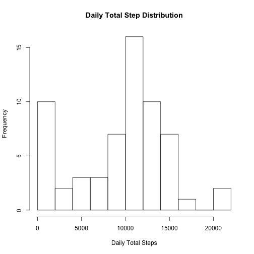

# Reproducible Research: Peer Assessment 1

Martin Hediger
==============


## Loading and preprocessing the data

### 1. Loading the data
The data is loaded using


```r
dat <- read.csv("activity.csv", header=TRUE)
```

### 2. Preprocessing the data
Using `head(dat)` and `str(dat)` the data is inspected.
Since the data appears tidy, no additional processing is carried out.

## What is mean total number of steps taken per day?

### 1 Histogram of the total number of steps taken each day
Using `tapply`, the data is factorized by date and then the `sum` function is applied to each cluster of data.
`NA` values are not removed from the data at this point because they would be converted to and enter the histogram as zeros.
Missing values are considered however when calculating the mean and median below.
The histogram of the so calculated daily total steps looks as follows.


```r
hist(tapply(dat$steps, dat$date, sum), breaks=10,
     main="Daily Total Step Distribution", xlab="Daily Total Steps", 
)
```

 

### 2 Mean and median total number of steps taken per day
To illustrate, the number of steps on a specific day can be calculated by:


```r
sum(dat[dat$date=="2012-11-29", 1])
```

```
## [1] 7047
```

Calculating the number of steps on each day can be done by calling (`NA` values are considered below):


```r
tapply(dat$steps, dat$date, sum)
```

The result of this calculation can also be obtained as a list (with appropriately labeled columns) by using `melt`:


```r
library(reshape2)
daily_sum <- melt(tapply(dat$steps, dat$date, sum))
colnames(daily_sum) <- c("Date", "Daily_Sum")
head(daily_sum)
```

```
##         Date Daily_Sum
## 1 2012-10-01        NA
## 2 2012-10-02       126
## 3 2012-10-03     11352
## 4 2012-10-04     12116
## 5 2012-10-05     13294
## 6 2012-10-06     15420
```

The mean total numer of steps is then:


```r
mean(daily_sum$Daily_Sum, na.rm=TRUE)
```

```
## [1] 10766
```

Similary, the median over all steps over the whole observation period is then


```r
median(daily_sum$Daily_Sum, na.rm=TRUE)
```

```
## [1] 10765
```


## What is the average daily activity pattern?


## Imputing missing values


## Are there differences in activity patterns between weekdays and weekends?
