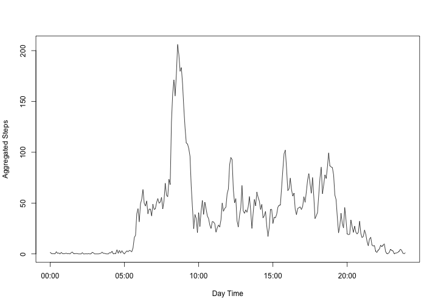

# Reproducible Research: Peer Assessment 1

Martin Hediger
==============


## Loading and preprocessing the data

### 1. Loading the data
The data is loaded using


```r
dat <- read.csv("activity.csv", header=TRUE)
```

### 2. Preprocessing the data
Using `head(dat)` and `str(dat)` the data is inspected.
Since the data appears tidy, no additional processing is carried out.

## What is mean total number of steps taken per day?

### 1 Histogram of the total number of steps taken each day
Using `tapply`, the data is factorized by date and then the `sum` function is applied to each cluster of data.
The histogram of the so calculated daily total steps looks as follows.


```r
hist(tapply(dat$steps, dat$date, sum, na.rm=TRUE), breaks=10,
     main="Daily Total Step Distribution", xlab="Daily Total Steps", 
)
```

 

### 2 Mean and median total number of steps taken per day
To illustrate, the number of steps on a specific day can be calculated by:


```r
sum(dat[dat$date=="2012-11-29", 1])
```

```
## [1] 7047
```

Calculating the number of steps on each day can be done by calling:


```r
tapply(dat$steps, dat$date, sum, na.rm=TRUE)
```

The result of this calculation can also be obtained as a list (with appropriately labeled columns) by using `melt`:


```r
library(reshape2)
daily_sum <- melt(tapply(dat$steps, dat$date, sum, na.rm=TRUE))
colnames(daily_sum) <- c("Date", "Daily_Sum")
head(daily_sum)
```

```
##         Date Daily_Sum
## 1 2012-10-01         0
## 2 2012-10-02       126
## 3 2012-10-03     11352
## 4 2012-10-04     12116
## 5 2012-10-05     13294
## 6 2012-10-06     15420
```

The mean total numer of steps is then (removing `NA` values):


```r
mean(daily_sum$Daily_Sum, na.rm=TRUE)
```

```
## [1] 9354
```

Similary, the median over all steps over the whole observation period is then


```r
median(daily_sum$Daily_Sum, na.rm=TRUE)
```

```
## [1] 10395
```


## What is the average daily activity pattern?

### 1 Time series plot of 5-minute interval and average number of steps taken

In the plot, the *x*-axis are just the interval values and the *y*-axis values are the averages of the steps taken during each day specific interval point.
First, the values for the x-axis are collect. These can be arbitrarily from any day (since all days ran throught the same interval) and are subsequently converted to POSIX format.


```r
x <- dat[dat$date=="2012-10-01", 3]
xs <- sprintf("%04d", x)
xt <- strptime(xs, format="%H%M")
```

Then the values for the y-axis are collected.
Here, the aggregate function can be used to calculate the mean over all days at a particular interval-value (`agsteps`)


```r
agsteps <- aggregate(. ~ interval, data=dat, FUN=mean)[2]
plot(xt, agsteps[[1]], type="l", xlab="Day Time", ylab="Aggregated Steps")
```

 

### 2 Maximum number of steps in 5-minute interval


```r
max(agsteps)
```

```
## [1] 206.2
```

```r
maxinterval <- which(agsteps==max(agsteps))
xt[maxinterval]
```

```
## [1] "2014-07-20 08:35:00"
```

The average maximum number of steps (206) are within the interval at 08:35 in the morning.


## Imputing missing values

### 1 Total number of missing values

A separate data frame consisting only of the data where `steps` are missing is constructed and by using the fact that R considers a `TRUE` value to equal 1, the number of `NA` values is calculated using `sum`:


```r
nas <- dat[is.na(dat$steps), ]
sum(is.na(nas$steps))
```

```
## [1] 2304
```

### 2+3 Strategy for filling in missing values

Inspired by a [Stackoverflow](http://stackoverflow.com/questions/9322773/how-to-replace-na-with-mean-by-subset-in-r-impute-with-plyr/9322975#9322975) post, first a replacement function is defined:


```r
library(plyr)
impute.mean <- function(x){
    replace(x, is.na(x), mean(x, na.rm=TRUE))
}
```

Then, an auxilary data frame is created:


```r
imputed <- ddply(dat[1:3], .(interval), transform, steps=impute.mean(steps), date=date, interval=interval)
```

Finally, the new data has to be sorted by date and interval:


```r
imputed <- imputed[order(imputed$date, imputed$interval), ]
head(imputed)
```

```
##       steps       date interval
## 1   1.71698 2012-10-01        0
## 62  0.33962 2012-10-01        5
## 123 0.13208 2012-10-01       10
## 184 0.15094 2012-10-01       15
## 245 0.07547 2012-10-01       20
## 306 2.09434 2012-10-01       25
```

Each `NA` value is now being replaced by it's mean from all days.

### 4 Histogram of total number of steps each day

Similarly to above:


```r
hist(tapply(imputed$steps, imputed$date, sum), breaks=10,
     main="Total Number of Steps Each Day\nwith NA Values Replaced by Day-mean",
     xlab="Daily Total Steps"
)
```

 

Calculating the mean and median of total number steps taken per day:


```r
imputed_daily_sum <- melt(tapply(imputed$steps, imputed$date, sum))
mean(imputed_daily_sum$value)
```

```
## [1] 10766
```

```r
median(imputed_daily_sum$value)
```

```
## [1] 10766
```

The values are different (obviously) from the above calculations, where missing values were not substituted by mean values.

## Are there differences in activity patterns between weekdays and weekends?

### 1 New factor variable: Weekday/Weekend

First, a logical vector is created which identifies weekend days in the imputed data which is then appended to the imputed data set:


```r
weekend <- weekdays(strptime(imputed$date, format="%Y-%m-%d")) %in% c("Samstag", "Sonntag")
imputed$weekend <- weekend
```

So if `imputed$weekend == TRUE`, the day corresponds to a weekend day.

### Panel plot to discern weekday from weekend activity

Create two separate data frames using the imputed data:


```r
acday <- imputed[!imputed$weekend, ]
acend <- imputed[imputed$weekend, ]
```

Then calculating the aggregated means for the two data sets.


```r
agday <- aggregate(. ~ interval, data=acday, FUN=mean)
agend <- aggregate(. ~ interval, data=acend, FUN=mean)
```

Combining the two to form a new data fram which is used for plotting.


```r
comb <- rbind(agday, agend)
str(comb)
```

```
## 'data.frame':	576 obs. of  4 variables:
##  $ interval: int  0 5 10 15 20 25 30 35 40 45 ...
##  $ steps   : num  2.251 0.445 0.173 0.198 0.099 ...
##  $ date    : num  31 31 31 31 31 31 31 31 31 31 ...
##  $ weekend : num  0 0 0 0 0 0 0 0 0 0 ...
```

```r
levels(factor(comb$weekend))
```

```
## [1] "0" "1"
```

Weekdays now have the `weekend` variable set to `0` and weekends to `1`.
The variable is cast to a factor:


```r
library(lattice)
xyplot(steps ~ interval|factor(weekend), data=comb, layout=c(1,2), type="l")
```

 
